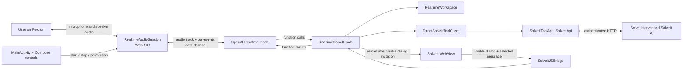

# PelotonSolveIt Realtime Engine

## Overview

The realtime engine adds a persistent, two-way spoken conversation to PelotonSolveIt. Unlike the existing Whisper/Vosk workflow, which records one utterance and turns it into text, a realtime session keeps the microphone and speaker connected to an OpenAI Realtime model. The user and model can talk naturally while the model reads from and writes to a deliberately selected SolveIt dialog through function tools.

There are two cooperating AI systems:

1. **The OpenAI Realtime model** is the spoken thinking and writing partner. It interviews the user, decides when to call tools, and speaks its responses.
2. **The SolveIt AI** runs inside SolveIt. The realtime model can ask it to do work by adding a `prompt` message to a dialog and running that message. This gives the spoken agent an indirect route to the SolveIt AI's broader context and capabilities.

The first version connects directly from the Android app to OpenAI using the API key compiled from `local.properties`. This is acceptable for the current private Peloton installation, but the key is present in the APK and is not appropriate for wider distribution. The session-negotiation boundary is intentionally isolated so a later version can exchange the SDP offer through a backend without rewriting the WebRTC engine.

## Architecture



The OpenAI connection has two paths over one WebRTC peer connection:

- The **media path** sends microphone audio and receives model audio. WebRTC and Android's audio device module handle capture, playback, acoustic echo cancellation, and noise suppression.
- The **data channel** named `oai-events` carries JSON protocol events such as session configuration, tool calls, tool results, errors, and requests for the model to continue responding.

## End-to-end session flow

### 1. Starting a conversation

`MainActivity.kt` owns the user-facing lifecycle. Pressing **Start Conversation**:

1. Checks or requests `RECORD_AUDIO` permission.
2. Clears the prior `RealtimeWorkspace` binding, so every conversation starts without an assumed working dialog.
3. Sets the Compose status to `Connecting…`.
4. Calls `RealtimeAudioSession.connect()` in the composable's coroutine scope.
5. On success, changes the button to **End Conversation**. On failure, closes partial resources, reports `Realtime failed`, and logs the exception under `RealtimeAudio`.

The realtime button and the existing one-shot microphone are mutually exclusive. The one-shot microphone is disabled while realtime is connecting or active, and realtime cannot start while a Whisper/Vosk recording is in progress. The two speech workflows otherwise remain separate.

### 2. Creating the WebRTC connection

`RealtimeAudioSession.connect()`:

1. Closes any previous session and resets its event-processing scope.
2. Initializes the WebRTC library and `JavaAudioDeviceModule`.
3. Requests Android's `VOICE_COMMUNICATION` audio source and enables supported hardware echo cancellation and noise suppression.
4. Creates a `PeerConnection`, a local microphone `AudioTrack`, and the `oai-events` `DataChannel`.
5. Creates an SDP offer and installs it as the local description.
6. Gives the offer to `RealtimeSessionNegotiator`.
7. Installs the returned SDP answer as the remote description.

The peer connection has an empty explicit ICE-server list. OpenAI's SDP answer supplies the information needed for the actual route. Observer callbacks log signaling, ICE gathering, ICE connection, peer connection, data-channel, and remote-track state. When a remote audio track arrives, it is enabled and played through Android's active audio output.

### 3. Negotiating directly with OpenAI

`DirectOpenAiSessionNegotiator` sends a multipart `POST` to:

```text
https://api.openai.com/v1/realtime/calls
```

The request contains:

- `sdp`: the local WebRTC offer as `application/sdp`;
- `session`: `RealtimeSessionConfig` as JSON; and
- `Authorization: Bearer <OPENAI_API_KEY>`.

The current default session is model `gpt-realtime-2.1` with voice `marin`. OpenAI returns the remote SDP answer as the HTTP response body.

`OPENAI_API_KEY` comes from ignored `local.properties` and is compiled into `BuildConfig.OPENAI_API_KEY` by `app/build.gradle.kts`. The same build-config value is also used by the existing Whisper transcription engine.

`RealtimeSessionNegotiator` is an interface specifically to keep authentication and session creation replaceable. A future backend implementation can accept the offer, authenticate server-side, call OpenAI, and return the answer while `RealtimeAudioSession` remains unchanged.

### 4. Configuring the model

When the data channel opens, `RealtimeAudioSession` sends two events:

1. A `session.update` built by `RealtimeSolveItTools.sessionUpdateEvent()`. It attaches the system instructions, sets `tool_choice` to `auto`, and publishes all SolveIt tool schemas.
2. A `response.create` asking for the brief spoken greeting: “Realtime conversation is ready. What would you like to work on?”

The greeting is a data-channel instruction. The model receives it, generates speech, and returns that speech on the WebRTC remote audio track.

The full system prompt is in `RealtimeAgentInstructions.kt`. It teaches the model:

- SolveIt's dialog, note, code, prompt, execution, and persistent-kernel model;
- the distinction between the realtime model and the SolveIt AI;
- how message placement affects the context seen by a SolveIt prompt;
- when to use each tool and when to confirm writes;
- how to coordinate the visible and working dialogs safely; and
- how to behave as a concise, interview-style spoken partner.

### 5. Handling tool calls

OpenAI sends completed function arguments as `response.function_call_arguments.done` events. Each event includes a `response_id`, `call_id`, tool name, and JSON arguments.

`RealtimeToolCallBatcher` groups calls by `response_id` and waits for that response's `response.done` event. This matters because one model response can contain multiple tool calls. Only if the response status is `completed` does the engine execute the batch; calls belonging to cancelled or incomplete responses are discarded.

`RealtimeAudioSession` executes a completed batch on an IO coroutine. A `Mutex` ensures batches are processed serially. For each call it:

1. Calls `RealtimeSolveItTools.execute()`.
2. Sends the result back as a `conversation.item.create` containing a `function_call_output` item with the matching `call_id`.
3. After all results have been sent, sends one `response.create` so the model can consume the outputs and continue speaking or call another tool.

Tool exceptions are converted to structured `{ "ok": false, "error": ... }` results so the model can explain and recover. Coroutine cancellation is deliberately rethrown rather than reported as a tool failure.

## SolveIt tools

The model receives seven function tools:

| Tool | Purpose |
| --- | --- |
| `get_ui_context` | Returns the latest visible dialog, selected WebView message, and explicitly bound working dialog. |
| `use_current_dialog` | Binds the currently visible dialog as the working dialog after the user asks or confirms. |
| `clear_working_dialog` | Clears the binding without navigating the WebView. |
| `view_dialog` | Reads the working dialog as compact XML, optionally filtered by message type and optionally including output. |
| `read_message` | Reads a single message by ID from the working dialog. |
| `add_message` | Adds a `note`, `code`, or `prompt` at the end or after a specified message. |
| `run_message` | Runs a code or prompt message and waits for it to finish. |

`RealtimeSolveItTools` is both the OpenAI protocol adapter and the policy boundary around these operations. It validates required arguments, maps API values to Kotlin enums, packages successful or failed JSON results, and invokes an `onDialogChanged` callback after mutations.

`SolveItToolClient` is the internal test seam. `DirectSolveItToolClient` is its production implementation and delegates to functions in `SolveItToolApi.kt`. Keeping the interface separate allows unit tests to use an in-memory fake without making SolveIt network calls.

The underlying API operations are:

- `find_msgs_` to view a dialog;
- `read_msg_` to read one message;
- `add_relative_` to add a message; and
- `add_runq_`, followed by polling `read_msg_`, to run a message and wait for completion.

All SolveIt requests go through `solveItPost()` in `SolveItApi.kt`, which uses `BuildConfig.SOLVEIT_URL` and authenticates with the `_solveit` cookie from `BuildConfig.SOLVEIT_TOKEN`. Logs include endpoint names, status codes, field names, and body sizes, but not message bodies or the token.

## Visible dialog versus working dialog

This distinction prevents the agent from writing to the wrong place when the user navigates during a conversation.

- The **visible dialog** is live WebView state reported by `SolveItJSBridge`. It can change at any moment.
- The **selected message** also comes from the WebView and belongs to the visible dialog.
- The **working dialog** is an explicit, conversation-local binding stored by `RealtimeWorkspace`.

A conversation can start before any dialog is open. It never automatically binds the first dialog it sees. When the user says to work in “this dialog,” the model first calls `get_ui_context`, then calls `use_current_dialog` after the user's intent is clear. Navigating elsewhere does not silently change the working dialog.

All read, add, and run operations require a working dialog. Starting a new realtime session clears the binding. If a tool mutates the dialog currently visible in the WebView, `MainActivity` reloads the WebView on the main thread so the change appears. A mutation to a different, bound dialog does not disrupt the user's current page.

## Coroutines and threading

The realtime code uses Kotlin coroutines at asynchronous boundaries:

- `rememberCoroutineScope().launch` starts connection negotiation without blocking Compose's main thread.
- `suspendCancellableCoroutine` wraps WebRTC's callback-style SDP methods (`createOffer`, `setLocalDescription`, and `setRemoteDescription`) as sequential suspend functions.
- `withContext(Dispatchers.IO)` runs blocking OpenAI and SolveIt HTTP calls away from the UI thread.
- `CoroutineScope(SupervisorJob() + Dispatchers.IO)` processes incoming tool events. A tool-call failure does not automatically cancel unrelated work in the scope.
- `Mutex.withLock` serializes tool-call batches and prevents overlapping `response.create` continuations.
- `close()` cancels the event scope before disposing WebRTC resources, preventing old-session work from leaking into a new session.

The `RealtimeConversationEngine` and `RealtimeState` types describe a future higher-level engine API and detailed state machine, but the current `RealtimeAudioSession` does not implement or expose them. Current UI state is held directly in `MainActivity` as `realtimeActive`, `realtimeConnecting`, and `realtimeStatus`.

## File map

### Realtime package

| File | Responsibility |
| --- | --- |
| [`RealtimeAudioSession.kt`](../app/src/main/java/com/stewart/pelotonsolveit/speech/realtime/RealtimeAudioSession.kt) | WebRTC lifecycle, Android audio tracks, data-channel events, tool-batch execution, greeting, cleanup, and diagnostics. |
| [`DirectOpenAiSessionNegotiator.kt`](../app/src/main/java/com/stewart/pelotonsolveit/speech/realtime/DirectOpenAiSessionNegotiator.kt) | Direct authenticated call to OpenAI's realtime SDP endpoint. |
| [`RealtimeSessionNegotiator.kt`](../app/src/main/java/com/stewart/pelotonsolveit/speech/realtime/RealtimeSessionNegotiator.kt) | Replaceable session-negotiation interface for a future backend. |
| [`RealtimeSessionConfig.kt`](../app/src/main/java/com/stewart/pelotonsolveit/speech/realtime/RealtimeSessionConfig.kt) | Model and voice defaults plus initial session JSON. |
| [`RealtimeAgentInstructions.kt`](../app/src/main/java/com/stewart/pelotonsolveit/speech/realtime/RealtimeAgentInstructions.kt) | System prompt and SolveIt operating guidance. |
| [`RealtimeSolveItTools.kt`](../app/src/main/java/com/stewart/pelotonsolveit/speech/realtime/RealtimeSolveItTools.kt) | Tool schemas, parsing, validation, execution, and result events. |
| [`RealtimeProtocol.kt`](../app/src/main/java/com/stewart/pelotonsolveit/speech/realtime/RealtimeProtocol.kt) | Multi-call response batching and safe OpenAI error descriptions. |
| [`RealtimeWorkspace.kt`](../app/src/main/java/com/stewart/pelotonsolveit/speech/realtime/RealtimeWorkspace.kt) | Explicit working-dialog binding and UI/working-context snapshots. |
| [`RealtimeConversationEngine.kt`](../app/src/main/java/com/stewart/pelotonsolveit/speech/realtime/RealtimeConversationEngine.kt) | Planned higher-level persistent-conversation interface; not wired yet. |
| [`RealtimeState.kt`](../app/src/main/java/com/stewart/pelotonsolveit/speech/realtime/RealtimeState.kt) | Planned detailed state model; not wired yet. |

### Integration and shared files

| File | Responsibility |
| --- | --- |
| [`MainActivity.kt`](../app/src/main/java/com/stewart/pelotonsolveit/MainActivity.kt) | Constructs realtime components, requests permission, starts/stops sessions, prevents microphone overlap, reloads changed dialogs, and logs diagnostics. |
| [`SolveItJSBridge.kt`](../app/src/main/java/com/stewart/pelotonsolveit/SolveItJSBridge.kt) | Exposes the visible dialog and selected message from JavaScript to Kotlin. |
| [`SolveItToolApi.kt`](../app/src/main/java/com/stewart/pelotonsolveit/network/SolveItToolApi.kt) | Typed view/read/add/run operations used by realtime tools. |
| [`SolveItApi.kt`](../app/src/main/java/com/stewart/pelotonsolveit/network/SolveItApi.kt) | Shared authenticated SolveIt HTTP transport. |
| [`Bars.kt`](../app/src/main/java/com/stewart/pelotonsolveit/ui/Bars.kt) | Places the realtime control in the top bar. |
| [`Components.kt`](../app/src/main/java/com/stewart/pelotonsolveit/ui/Components.kt) | Implements the start/end conversation button and its visual states. |
| [`app/build.gradle.kts`](../app/build.gradle.kts) | Builds secrets into `BuildConfig` and adds the Android WebRTC dependency. |
| [`AndroidManifest.xml`](../app/src/main/AndroidManifest.xml) | Declares internet, network-state, and microphone permissions. |

### Tests

| File | Coverage |
| --- | --- |
| [`RealtimeSolveItToolsTest.kt`](../app/src/test/java/com/stewart/pelotonsolveit/speech/realtime/RealtimeSolveItToolsTest.kt) | Tool publication, instructions, protocol output construction, dialog-binding isolation, recoverable errors, mutations, and callbacks. |
| [`RealtimeProtocolTest.kt`](../app/src/test/java/com/stewart/pelotonsolveit/speech/realtime/RealtimeProtocolTest.kt) | Multi-call batching, independent responses, cancellation handling, and safe/truncated error diagnostics. |

Run the local unit tests and build with:

```bash
./gradlew testDebugUnitTest assembleDebug
```

The WebRTC media path itself requires an Android device or emulator with microphone/audio support and network access; the protocol and tool behavior are covered by JVM unit tests without a Peloton.

## Diagnostics and troubleshooting

Filter Android logs with the `RealtimeAudio` tag. A healthy connection normally advances through messages resembling:

```text
Initializing WebRTC
Creating SDP offer
Negotiating with OpenAI
OpenAI returned SDP answer
Remote description accepted
Data channel: OPEN
Configured SolveIt tools
Requested initial greeting
Peer connection: CONNECTED
Remote audio track received
```

Incoming data-channel event types are also logged. Tool execution logs the tool name and whether its result was returned. OpenAI error logging intentionally extracts only bounded diagnostic fields (`code`, `param`, `event_id`, and a truncated message) instead of dumping arbitrary event payloads.

Useful terms:

- **SDP (Session Description Protocol):** the offer/answer text that describes each peer's media and connection capabilities.
- **ICE (Interactive Connectivity Establishment):** WebRTC's process for finding a working network route between peers.
- **Peer connection:** the WebRTC object that owns negotiated media and data transport.
- **Data channel:** an ordered WebRTC channel used here for OpenAI's JSON events, separate from audio.
- **Function call output:** the protocol item that returns an Android-executed tool result to the model.

## Current boundaries and likely next steps

- The OpenAI API key is embedded in the APK. Before distribution or reuse on less-controlled surfaces, move session negotiation to a backend and keep the long-lived key there.
- UI connection state currently means negotiation returned successfully; it is not driven by the complete `RealtimeState` state machine.
- There is no native transcript panel or persisted realtime transcript. Durable content is created intentionally through SolveIt tools.
- The engine relies on OpenAI's server-side turn handling and WebRTC audio behavior; there is not yet an explicit native interrupt control.
- SolveIt tool access is intentionally limited to the working dialog. Broader work is delegated by adding and running a prompt for the SolveIt AI.
- The WebView is reloaded after a visible-dialog mutation. A more targeted JavaScript refresh could eventually preserve finer-grained page state.
